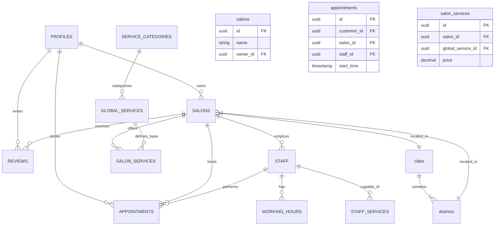

# Güzellik Randevu - Teknik Dokümantasyon ve Proje Analizi

Bu belge, **Güzellik Randevu** projesinin mevcut teknik durumunu, mimarisini, sahip olduğu özellikleri ve gelecekteki geliştirme ihtiyaçlarını (Gap Analysis) detaylı bir şekilde ortaya koyar.

---

## 1. Proje Özeti
**Güzellik Randevu**, güzellik salonları, kuaförler ve berberler için geliştirilmiş, çok rollü (Müşteri, Salon Sahibi, Personel, Admin) bir SaaS (Software as a Service) platformudur. Kullanıcıların hizmet arayıp randevu alabileceği, işletmelerin ise personellerini, hizmetlerini ve randevularını yönetebileceği kapsamlı bir pazar yeri (marketplace) yapısına sahiptir.

---

## 2. Teknoloji Yığını (Tech Stack)

### Core (Çekirdek)
*   **Framework:** Next.js 16 (App Router)
*   **Dil:** TypeScript (Strict Mode)
*   **UI Kütüphanesi:** React 19
*   **Veritabanı & Backend:** Supabase (PostgreSQL 15+)
*   **ORM/Query:** Supabase JS Client (`@supabase/supabase-js`, `@supabase/ssr`)

### Frontend & Styling
*   **CSS Framework:** Tailwind CSS 3.4
*   **İkon Seti:** Lucide React
*   **Harita:** React Leaflet (OpenStreetMap tabanlı)
*   **Grafikler:** Recharts
*   **Fontlar:** Google Fonts (Next/Font)

### Servisler & Entegrasyonlar
*   **AI (Yapay Zeka):** Google Gemini AI (Muhtemelen metin üretimi veya öneri sistemleri için)
*   **SMS:** NetGSM (OTP ve bildirimler için entegrasyon mevcut)
*   **Depolama:** Supabase Storage (Resim ve medya dosyaları için)

---

## 3. Sistem Mimarisi ve Modüller

Proje, rol tabanlı erişim kontrolü (RBAC) üzerine kurulmuştur.

### A. Roller ve Paneller
1.  **Platform Admin:** Tüm sistemi yönetir, master verileri (şehirler, kategoriler) düzenler. `app/admin`
2.  **Salon Sahibi (Owner):** Kendi işletmesini, personelini ve hizmetlerini yönetir. `app/owner`
3.  **Personel (Staff):** (Geliştirme aşamasında) Kendi randevularını görür. `app/staff`
4.  **Müşteri (Customer):** Salon arar, randevu alır, favorilerim/geçmiş işlemlerim. `app/customer`

### B. Veritabanı Mimarisi (Database Schema)
Veritabanı **PostgreSQL** üzerindedir ve ilişkisel (relational) bir yapıya sahiptir.

*   **Kullanıcı Yönetimi:** `profiles`, `invites` (davetiye sistemi), `otp_codes` (SMS doğrulama).
*   **Lokasyon:** `cities` (İl), `districts` (İlçe) - Master data.
*   **Hizmet Yapısı:**
    *   `service_categories`: Ana kategoriler (Saç, Bakım vb.).
    *   `global_services`: Platform geneli standart hizmet listesi.
    *   `salon_services`: Salonun sunduğu hizmetler (Fiyat ve süre özelleştirmeli).
    *   `staff_services`: Hangi personelin hangi hizmeti verebildiği (Yetkinlik matrisi).
*   **İşletme (Salon):** `salons`, `salon_types`, `salon_assigned_types`, `salon_working_hours`.
*   **Randevu ve Zamanlama:**
    *   `appointments`: Ana randevu tablosu.
    *   `working_hours`: Personel bazlı çalışma saatleri ve izinler.
*   **Etkileşim:** `reviews` (Puanlama/Yorum), `favorites`, `notifications`.

---

## 4. Mevcut Özellikler (Neyimiz Var?)

### ✅ Kullanıcı ve Güvenlik
*   **Kimlik Doğrulama:** Supabase Auth ile Email/Password girişi.
*   **Role Based Access Control (RBAC):** Middleware seviyesinde rol bazlı sayfa koruması.
*   **Row Level Security (RLS):** Veritabanı seviyesinde veri güvenliği (Örn: Bir salon sahibi sadece kendi salonunu görebilir).
*   **OTP Doğrulama:** Telefon numarası doğrulama altyapısı (`otp_codes`).

### ✅ İşletme Yönetimi (Onboarding & Dashboard)
*   **Onboarding Wizard:** Yeni salonların adım adım kaydedilmesi (Bilgiler, Konum, Saatler, Hizmetler, Personel).
*   **Harita Entegrasyonu:** Konum seçimi ve görselleştirme için harita.
*   **Hizmet Yönetimi:** Global hizmetlerden seçim yapıp fiyat/süre özelleştirme.
*   **Personel Yönetimi:** Personel ekleme, rol atama ve hizmet yetkilendirme.
*   **Çalışma Saatleri:** Salon ve personel bazlı esnek mesai yönetimi.

### ✅ Randevu Sistemi
*   **Gelişmiş Slot Algoritması:** Personelin çalışma saatlerine, hizmet süresine ve mevcut doluluğuna göre boş saatleri hesaplayan `slot.ts` servisi.
*   **Service-Staff Eşleşmesi:** Seçilen hizmeti verebilen personellerin filtrelenmesi.

### ✅ Müşteri Deneyimi
*   **Arama ve Filtreleme:** Kategori ve konuma göre salon arama.
*   **Profil Yönetimi:** Müşteri profil ve iletişim bilgileri.
*   **Değerlendirme Sistemi:** Hizmet sonrası yorum ve puanlama (`reviews`).

### ✅ Altyapı
*   **Audit Logging:** Kritik işlemlerin kaydı (`audit.ts`).
*   **Bildirim Sistemi:** Veritabanı tabanlı bildirim altyapısı.

---

## 5. Eksikler ve Geliştirme Alanları (Neyimiz Yok / Gap Analysis)

Aşağıdaki maddeler, mevcut kod tabanında (dosya yapısı ve veritabanı şeması incelendiğinde) tam olarak görülmeyen veya geliştirilmeye açık alanlardır.

### 🔴 Ödeme Sistemi (Payment Gateway)
*   **Durum:** Projede ödeme altyapısına dair (Iyzico, Stripe vb.) belirgin bir entegrasyon kodu veya `transactions/payments` tablosu **görünmemektedir**.
*   **İhtiyaç:** Randevu sırasında kapora alma, kredi kartı ile ödeme veya cüzdan sistemi.

### 🔴 Gelişmiş Takvim Görünümü (Calendar View)
*   **Durum:** Admin ve Salon sahipleri için "Drag & Drop" özellikli, günlük/haftalık/aylık detaylı takvim arayüzü (FullCalendar vb. enterasyonu) backend tarafında desteklense de frontend tarafında tam teşekküllü bir takvim yönetim paneli geliştirilmesi gerekebilir.

### 🔴 Pazarlama ve Kampanyalar
*   **Durum:** Kupon, indirim kodu veya sadakat programı (Loyalty) altyapısı veritabanında **yoktur**.
*   **İhtiyaç:** `coupons`, `campaigns` tabloları ve indirim hesaplama motoru.

### 🔴 Raporlama ve Analitik
*   **Durum:** `Recharts` kütüphanesi var ancak kapsamlı finansal raporlar (günlük ciro, personel performansı, iptal oranları) için özel `views` veya aggregation sorguları geliştirilmeli.

### 🔴 Mobil Uygulama (Native)
*   **Durum:** Mevcut proje Responsive Web App (PWA uyumlu olabilir) yapısındadır. Native (iOS/Android) bir kod tabanı yoktur.

### 🔴 Gerçek Zamanlı İletişim (Realtime)
*   **Durum:** Supabase Realtime özelliği kullanılabilir ancak Chat/Mesajlaşma (Müşteri <-> Salon) özelliği şu anki şemada yer almıyor.

---

## 6. Önerilen Yol Haritası (Next Steps)

1.  **Ödeme Entegrasyonu:** Iyzico veya benzeri bir sanal POS entegrasyonunun yapılması.
2.  **Admin Takvimi:** Salon sahipleri için randevuları sürükle-bırak ile yönetebilecekleri interaktif bir takvim modülü.
3.  **Kampanya Modülü:** İndirim kodu ve kampanya altyapısının veritabanına eklenmesi.
4.  **SEO Optimizasyonu:** `next-sitemap` ve meta tag entegrasyonlarının tüm detay sayfaları için tamamlanması.
