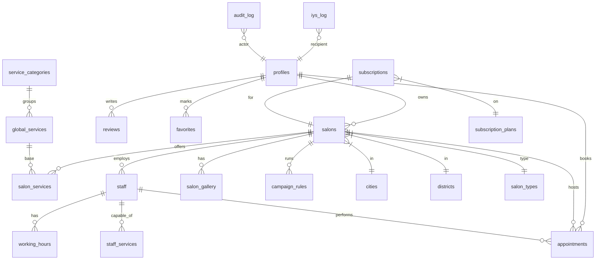

# Güzellik Randevu — Yazılım Gereksinim ve Tasarım Belgesi

> Bu belge **tek doğruluk kaynağı (single source of truth)** olarak tutulur. Her yeni özellik geliştirildiğinde ilgili modül altına eklenir, tarih/sürüm güncellenir.

| Alan | Değer |
|------|-------|
| Sürüm | 1.1.2 |
| Son güncelleme | 27.06.2026 |
| Sahip | Murat Yolal |
| Repo | `guzellik-randevu-ui` |
| Domain | `kuaforara.com.tr` |

---

## 0. Belge Yapısı

Her özellik aşağıdaki şablonla yazılır:

```
### [F-XXX] Başlık
**Aktör:** kim kullanır
**Amaç:** neyi çözer
**Tetikleyici:** ne zaman çalışır
**Akış:** adım adım
**Veri:** etkilenen tablolar
**Arayüz:** ilgili sayfa/component
**API:** endpoint(ler)
**Kısıt / TODO:** bilinen eksikler
```

---

## 1. Sistem Genel Bakış

**Güzellik Randevu**, salon işletmelerini (kuaför, berber, güzellik merkezi) müşterilerle buluşturan **çok kiracılı (multi-tenant) SaaS marketplace** uygulamasıdır.

| Katman | Teknoloji |
|--------|-----------|
| Framework | Next.js 16 (App Router), React 19 |
| Backend | Supabase (PostgreSQL 15+, self-hosted Docker) |
| Auth | Supabase Auth + custom OTP |
| Stil | Tailwind CSS (shadcn/ui tarzı) |
| Ödeme | Iyzico |
| SMS | NetGSM / İletiMerkezi |
| Email | Resend |
| AI | Google Gemini |
| Harita | React Leaflet (OpenStreetMap) |
| Bot koruması | Cloudflare Turnstile |
| Hata izleme | Sentry |
| Rate limit | Upstash Redis (in-memory fallback) |

**Mimari prensipler:**
- Veritabanı seviyesinde güvenlik (RLS — her tabloda zorunlu)
- Service layer üzerinden tüm DB erişimi (`@/services/db/db_*.ts`)
- Subdomain bazlı tenant routing (`*.kuaforara.com.tr`)
- Server-side admin client RLS bypass için (`supabaseAdmin`)
- Türkçe UI / İngilizce kod

---

## 2. Roller ve Yetkilendirme

| Rol | Kapsam | Panel |
|-----|--------|-------|
| `CUSTOMER` | Salon arar, randevu alır | `/customer/*` |
| `STAFF` | Kendi randevularını görür | `/staff/*` |
| `MANAGER` | Salon yöneticisi (sahip değil) | `/owner/*` |
| `SALON_OWNER` | Salon CRUD, personel yönetimi | `/owner/*` |
| `ADMIN` | Master data yönetimi | `/admin/*` |
| `SUPER_ADMIN` | Tüm sistem yönetimi | `/admin/*` |

**Uygulama:** [middleware.ts](middleware.ts) → URL path bazlı redirect + `is_active=false` kullanıcılarda otomatik logout.

### 2.1 Test Hesapları (lokal / geliştirme)

> Aşağıdaki hesaplar **self-hosted lokal DB** içindir; test ekibi panelleri denerken kullanır. Şifreler DB'deki bcrypt hash'ine karşı doğrulanmıştır. **Production'da geçerli değildir.**

| Rol | E-posta | Şifre | Panel |
|-----|---------|-------|-------|
| `SUPER_ADMIN` | `admin@demo.com` | `password123` | `/admin/*` |
| `SALON_OWNER` | `owner@demo.com` | `password123` | `/owner/*` |
| `STAFF` | `staff@demo.com` | `password123` | `/staff/*` |
| `CUSTOMER` | `customer@demo.com` | `password123` | `/customer/*` |

**Notlar:**

- `UserRole` tipi 6 rol tanımlar; lokal DB'de yalnızca yukarıdaki 4'ü doludur (`MANAGER` ve `ADMIN` için seed kaydı yoktur).
- Telefon/OTP ile giriş test edilirken `OTP_DEMO_MODE=true` olduğundan doğrulama kodu **her zaman `111111`** kabul edilir, SMS gönderilmez.
- Hesap kaynağı: `initdb/archive/old/11-demo-users.sql` (auth.users + profiles seed).

---

## 3. Modül: Kimlik Doğrulama

### [F-001] Email/Password ile Kayıt ve Giriş
**Aktör:** Misafir kullanıcı
**Amaç:** Üye hesabı oluşturma ve oturum açma
**Akış:**
1. Kullanıcı `/register` veya `/register/business`'e gider
2. Email + password + KVKK rıza checkbox
3. Supabase Auth `signUp` → email doğrulama linki gönderilir
4. Doğrulanmış kullanıcı `/login`'den giriş yapar
**Veri:** `auth.users`, `profiles`
**Arayüz:** [app/login](app/login), [app/register](app/register), [app/register/business](app/register/business)
**Kısıt:** Şu an doğrulama linksiz hesaplar da oluşur (development konforu için).

### [F-002] OTP ile Telefon Doğrulama
**Aktör:** Kayıtlı kullanıcı (booking flow'unda)
**Amaç:** Randevu öncesi telefon sahipliğini doğrulamak
**Tetikleyici:** Booking confirmation adımında
**Akış:**
1. Kullanıcı telefon girer → `POST /api/booking/send-otp`
2. 6 haneli kod oluşur (5 dk geçerli), SMS ile gönderilir
3. Kullanıcı kodu girer → `POST /api/booking/verify-and-book`
4. Doğru kod → randevu oluşturulur
**Veri:** `otp_codes` (RLS: sadece `service_role` erişebilir — anon/auth okuyamaz)
**API:** [app/api/booking/send-otp](app/api/booking/send-otp), [app/api/booking/verify-and-book](app/api/booking/verify-and-book)
**Rate limit:** Telefon başına 3/dk + IP başına 8/dk
**Demo mode:** `OTP_DEMO_MODE=true` → her zaman `111111` kabul edilir

### [F-003] KVKK Rıza Yönetimi
**Aktör:** Tüm kullanıcılar
**Amaç:** 6698 sayılı Kanun uyumu — kişisel veri işleme rızası
**Akış:**
1. Kayıt formunda KVKK checkbox zorunlu
2. `profiles.kvkk_consent` ve `kvkk_consent_at` kaydedilir
3. Çerez tercihleri için sayfa altında banner ([components/CookieBanner.tsx](components/CookieBanner.tsx))
4. Veri talebi formu: [/kvkk/veri-talebi](app/kvkk/veri-talebi/page.tsx)
**Arayüz:** [/kvkk](app/kvkk/page.tsx) (aydınlatma metni)

---

## 4. Modül: Salon İşletme

### [F-010] Salon Onboarding Wizard
**Aktör:** SALON_OWNER
**Akış:** 5 adımlı wizard — Bilgiler → Konum (harita) → Çalışma Saatleri → Hizmetler → Personel
**Veri:** `salons`, `salon_working_hours`, `salon_services`, `staff`, `salon_assigned_types`
**Arayüz:** [/owner/onboarding](app/owner/onboarding)
**Kısıt:** İlk kayıt sonrası salon `status='SUBMITTED'` olur, admin onayı bekler.

### [F-011] Salon Onay Akışı
**Aktör:** SUPER_ADMIN
**Salon durumları:** `DRAFT | SUBMITTED | REVISION_REQUESTED | APPROVED | REJECTED | SUSPENDED | DELETED | PASSIVE`
**Akış:**
1. Salon SUBMITTED → admin paneline düşer
2. Admin onaylar (`APPROVED`) veya revizyon ister (`REVISION_REQUESTED`)
3. Reddedilen salonlar `RLS` ile public listingden gizlenir
**Arayüz:** [/admin/approvals](app/admin/approvals)
**Kısıt:** Otomatik onay yok; manuel zorunlu.

### [F-012] Salon Detay Görüntüleme (Public)
**Aktör:** Misafir + tüm roller
**Akış:** `/salon/[id]` veya subdomain `*.kuaforara.com.tr`
**Veri:** `salon_details` view
**Arayüz:** [app/salon/[id]/page.tsx](app/salon/[id]/page.tsx)
**SEO:** JSON-LD `BeautySalon` + `BreadcrumbList` schemas otomatik basılır.

### [F-013] Galeri Yönetimi
**Aktör:** SALON_OWNER
**Veri:** `salon_gallery` (image_url, display_order, is_cover, caption)
**Arayüz:** Owner paneli + salon detay slider
**Migration:** `New-03-Campaign-Rules-And-Gallery.sql`

---

## 5. Modül: Hizmet ve Personel

### [F-020] Hizmet Yönetimi
**Veri yapısı:** `service_categories` → `global_services` → `salon_services` (fiyat/süre özelleştirilir)
**Yetkinlik matrisi:** `staff_services` (hangi personel hangi hizmeti verebilir)
**View:** `salon_service_details` (join: salon_services + global_services + categories)
**Subscription limit:** Plan başına servis sayısı sınırlı (`SubscriptionService.checkLimit`)

### [F-021] Personel Yönetimi
**Aktör:** SALON_OWNER
**Veri:** `staff`, `working_hours` (gün bazlı, izin günü flag'i ile)
**Davetiye akışı:** `invites` tablosu — owner email gönderir, personel link ile katılır → `acceptStaffInvite` RPC
**Faz 4 alanları:** `tc_no`, `is_email_verified`, `is_phone_verified`, `kvkk_consent`
**Visibility kuralı:** Doğrulanmış (email/telefon) VEYA KVKK rıza vermiş personeller public listede

### [F-022] Çalışma Saatleri
**Salon seviyesi:** `salon_working_hours` (haftanın 7 günü, açık/kapalı)
**Personel seviyesi:** `working_hours` (haftalık + izin günleri)
**Slot algoritması:** [services/slot.ts](services/slot.ts) — personel mesai ∩ mevcut randevu boşlukları ∩ servis süresi

---

## 6. Modül: Randevu Sistemi

### [F-030] Randevu Akışı (4 Adım)
**Akış:**
1. `/booking/[id]` → hizmet seç (multi-select)
2. `/booking/[id]/staff` → personel seç (veya "Herhangi biri")
3. `/booking/[id]/time` → uygun slot seç
4. `/booking/[id]/confirm` → telefon doğrulama (OTP) → ödeme yönlendir
**Veri:** `appointments` (status: `PENDING|CONFIRMED|COMPLETED|CANCELLED|NO_SHOW`)
**API:** [app/api/booking/create](app/api/booking/create)
**State persistence:** [context/BookingContext.tsx](context/BookingContext.tsx) — sayfa yenileme veya geri tuşunda state korunsun diye `sessionStorage`'a yazılır (key: `booking-state-v1`, TTL: 2 saat). Tab kapatılınca otomatik temizlenir. Salon değişince eski state geçersiz sayılır.
**Bildirim:**
- SMS (zorunlu, `sendAppointmentSMS`)
- Email (opsiyonel, Resend ile, `renderAppointmentConfirmation`)
**Rate limit:** Kullanıcı başına 10/dk + IP başına 5/dk

### [F-031] Müsait Slot Hesaplama
**Endpoint:** `GET /api/booking/available-slots?salonId=&staffId=&date=&serviceIds=`
**Algoritma:**
1. Personelin o günkü mesaisi alınır
2. Mevcut randevular (CONFIRMED/PENDING) hariç tutulur
3. Toplam servis süresi kadar boş aralıklar bulunur
4. 15 dk granülaritesinde slotlar döner

### [F-032] Randevu İptali ve Yeniden Planlama
**Aktör:** Müşteri / Salon sahibi
**API:** `POST /api/booking/cancel`
**Cancellation Policy (enforce):**
- Randevuya **1 saatten az** kala iptal yasak — HTTP 400 + `code: 'CANCELLATION_LOCKED'`
- Eşik değiştirilebilir: `CANCELLATION_HARD_LOCK_MINUTES` env (default 60)
- Zaten iptal edilmiş veya tamamlanmış randevular için tekrar iptal hatası
**Refund Policy:**
- `salons.cancellation_deadline_hours` (default 24) — bu süreden önce iptal: full refund
- Iyzico üzerinden otomatik refund (`IyzicoService.refund`)
- Refund başarısız olursa randevu yine iptal edilir, `notes` alanına hata yazılır
**TODO:** Reschedule akışı için ayrı endpoint (şu an cancel + new booking gerekli)

---

## 7. Modül: Ödeme

### [F-040] Iyzico Ödeme Entegrasyonu
**Aktör:** Müşteri (booking flow sonunda)
**Akış:**
1. Booking onaylanınca `IyzicoLinkService` ile ödeme linki oluşturulur
2. Müşteri Iyzico hosted page'e yönlendirilir
3. Ödeme sonrası `appointments.payment_status` güncellenir, callback URL'ye dönüş yapılır
**Veri:** `transactions` (planlanmış)
**Modlar:** Sandbox (default) + Production
**API:** [app/api/iyzico](app/api/iyzico)
**TODO:** Iade (refund) akışı + chargeback yönetimi

### [F-041] Kapora ve Tam Ödeme
**Veri:** `salons.deposit_rate` (kapora yüzdesi)
**Akış:** Müşteri kapora öder, kalan salonda ödenir.
**TODO:** Cüzdan / wallet sistemi.

---

## 8. Modül: İletişim (SMS, Email, IYS)

### [F-050] SMS Gönderimi
**Provider:** NetGSM veya İletiMerkezi (env değişkenlerine göre seçilir)
**Tipler:**
- Transactional: OTP, randevu onay, hatırlatma (rıza gerektirmez)
- Marketing: Kampanya bildirimi (rıza zorunlu)
**Helper:** [lib/messaging/sms.ts](lib/messaging/sms.ts)

### [F-051] Email Gönderimi (Transactional)
**Provider:** Resend
**Templates:**
- Booking confirmation (`renderAppointmentConfirmation`)
- Booking cancellation (`renderAppointmentCancellation`)
**Helper:** [lib/messaging/email.ts](lib/messaging/email.ts)
**Demo mode:** `RESEND_API_KEY` boşsa sadece loglar

### [F-052] IYS (İletişim Yönetim Sistemi) Log
**Yasal zorunluluk:** Türkiye'de ticari elektronik ileti için izin/log zorunlu
**Tablo:** `iys_log` — recipient, channel, message_type, status, consent_id, ...
**Helper:** [lib/messaging/iys.ts](lib/messaging/iys.ts) → `logIys()`, `hasMarketingConsent()`
**TODO:** Gerçek IYS API bridge (iys.org.tr) — şu an sadece local kayıt

---

## 9. Modül: Pazarlama

### [F-060] Kampanya Kuralları
**Tablo:** `campaign_rules` — discount_type (PERCENTAGE/FIXED), discount_value, days_of_week, time_window
**Akış:** Booking sırasında uygun kampanya otomatik uygulanır
**Migration:** `New-03-Campaign-Rules-And-Gallery.sql`

### [F-061] Kupon Kodları
**Tablo:** `coupons`
**Veri:** code, discount_type, discount_value, max_discount_amount, valid_from/until, usage_limit
**Doğrulama:** Booking endpoint'inde server-side
**TODO:** Customer-facing kupon yönetimi UI

---

## 10. Modül: Abonelik (Subscription)

### [F-070] Plan Sistemi
**Planlar:** `STARTER | PRO | BUSINESS | ELITE`
**Tablo:** `subscriptions`, `subscription_plans`
**Limitler:** Plan başına `max_staff`, `max_services`, `max_branches`
**Enforcement:** [services/db/db_finance.ts](services/db/db_finance.ts) → `SubscriptionService.checkLimit()`
**Guard component:** [components/PlanGuard.tsx](components/PlanGuard.tsx)

### [F-071] Owner Finans Paneli
**Arayüz:** [/owner/finance](app/owner/finance)
**Görünen:** Aktif plan, limit kullanımı, ödeme geçmişi
**TODO:** Plan upgrade/downgrade akışı

---

## 11. Modül: Müşteri Deneyimi

### [F-080] Salon Arama ve Filtreleme
**Arayüz:** Ana sayfa + `/search`
**Filtre:** Şehir, ilçe, kategori, hizmet adı, puan, "bugün açık"
**Veri kaynağı:** `salon_details` view
**Harita:** Yan yana split (liste + harita)

### [F-081] Favoriler
**Tablo:** `favorites` (user_id + salon_id)
**Arayüz:** Salon kartında kalp ikonu, [/customer/favorites](app/customer/favorites)

### [F-082] Değerlendirme Sistemi
**Tablolar:** `reviews` (salon yorumu), `staff_reviews` (uzman yorumu), `review_images`
**Kural:** Sadece tamamlanmış randevudan sonra yorum yazılabilir
**Doğrulama:** `is_verified` flag (appointment_id varsa)
**View:** `verified_reviews_view`

### [F-083] Bildirim Merkezi
**Tablo:** `notifications`
**Arayüz:** Header'daki çan ikonu → [components/NotificationCenter.tsx](components/NotificationCenter.tsx)
**Tipler:** Randevu durumu, mesaj, sistem duyurusu

---

## 12. Modül: Güvenlik

### [F-090] Rate Limiting
**Modül:** [lib/rate-limit.ts](lib/rate-limit.ts)
**Provider:** Upstash Redis (production) → in-memory fallback (dev)
**Uygulanan endpoint'ler:**
- `POST /api/booking/create` — IP başına 5/dk
- `POST /api/booking/send-otp` — IP başına 8/dk
**Yanıt:** 429 + Retry-After header

### [F-091] Cloudflare Turnstile (Bot Koruması)
**Form:** Booking OTP send adımı (booking confirmation)
**Bileşen:** [components/common/Turnstile.tsx](components/common/Turnstile.tsx) — script lazy-load, demo mode (env yoksa atlar)
**Server verify:** [lib/turnstile.ts](lib/turnstile.ts) → `verifyTurnstile(token, ip)` (Cloudflare siteverify endpoint)
**Entegrasyon:** `POST /api/booking/send-otp` body'de `turnstileToken` bekler, fail → HTTP 403
**Env:** `NEXT_PUBLIC_CLOUDFLARE_TURNSTILE_SITE_KEY` (client) + `CLOUDFLARE_TURNSTILE_SECRET_KEY` (server)
**Demo mode:** Secret yoksa veya token "demo-no-turnstile" ise verify true döner (development)

### [F-092] Row Level Security (RLS)
**Politika hiyerarşisi:**
| Rol | Yetki |
|-----|-------|
| SUPER_ADMIN/ADMIN | Tüm tablolarda full (service role bypass eder) |
| OWNER | Kendi `salon_id`/`owner_id`'lerinde full (DELETE yasak) |
| STAFF | Sadece kendi randevuları + working hours |
| CUSTOMER | Kendi randevu/profile + APPROVED salon verisi |
| anon | Sadece `APPROVED` salon + lookup tabloları |

**Migration kayıtları:** `initdb/New-XX-*.sql`, rollback'leri [initdb/rollbacks/](initdb/rollbacks/)

**RLS + GRANT ikilisi (zorunlu birlikte kurulum):** Self-hosted Supabase'de RLS politikası TEK BAŞINA YETMEZ. PostgREST tabloya erişebilmek için rol bazlı `GRANT SELECT/INSERT/UPDATE/DELETE` de gerektirir; eksikse client-side Supabase JS'ten yanıltıcı boş `{}` hatası döner. Yeni tablo veya yeni RLS kurulumunda **politika + GRANT birlikte yazılmalı** ve `db-health-check.sql` Section 8 audit'i ile doğrulanmalıdır. Mevcut audit referans implementasyonları: `New-09` (service_role), `New-12` (notifications), `New-14` (support_tickets + 17 tablo authenticated SELECT audit).

### [F-093] Sentry Hata İzleme
**Config:** [sentry.client.config.ts](sentry.client.config.ts), [sentry.server.config.ts](sentry.server.config.ts), [sentry.edge.config.ts](sentry.edge.config.ts)
**Aktivasyon:** `NEXT_PUBLIC_SENTRY_DSN` + `SENTRY_DSN` env
**Yakalanan:** Tüm uncaught exceptions, Promise rejections, server errors

---

## 13. Modül: Operasyon

### [F-100] Health Check Endpoint
**URL:** `/api/health`
**Kontroller:** DB ping, Resend config, Sentry config, Iyzico config
**Yanıt:** 200 (healthy) veya 503 (degraded)
**Tüketici:** UptimeRobot — 5 dk interval

### [F-101] Backup Otomasyonu
**Script:** [scripts/local-backup-db.bat](scripts/local-backup-db.bat) (pg_dump → `db_backups/db_backup_*.sql`)
**Wrapper:** [scripts/backup-scheduler.ps1](scripts/backup-scheduler.ps1) (log + cmd çağırma)
**Task:** `GuzellikRandevu_Backup` — günlük 03:00
**Retention:** [scripts/backup-retention.ps1](scripts/backup-retention.ps1) — 30 gün üstü temizler
**Retention task:** `GuzellikRandevu_BackupRetention` — günlük 04:30

### [F-102] Migration Workflow
**Klasör:** `initdb/New-XX-Description.sql` (incremental, sıralı)
**Master:** `initdb/Master-Database-Setup.sql`
**Rollback:** Her migration için `initdb/rollbacks/Rollback-XX-*.sql`
**Uygulama:** `docker exec -i supabase-db psql -U postgres -d postgres < ...`
**MCP:** Supabase MCP veya Postgres MCP ile direkt query

### [F-103] Audit Logging
**Tablo:** `audit_log` (kullanıcı, eylem, kaynak, eski/yeni değer)
**Helper:** [services/audit.ts](services/audit.ts)
**Kapsam:** Salon onayı, kullanıcı suspend, kritik veri değişiklikleri

---

## 14. Modül: SEO ve Discoverability

### [F-110] Structured Data (JSON-LD)
**Şemalar:** `Organization`, `WebSite`, `BeautySalon`, `BreadcrumbList`
**Bileşen:** [components/seo/JsonLd.tsx](components/seo/JsonLd.tsx)
**Uygulanma:** Ana sayfa + tüm salon detay sayfaları otomatik

### [F-111] Metadata Standardizasyonu
**Helper:** [lib/seo/metadata.ts](lib/seo/metadata.ts) → `buildPageMetadata()`
**İçerik:** title template, OG, Twitter card, canonical URL
**TODO:** `/search`, `/booking/*` ve `/customer/*` sayfalarında uygula

### [F-112] PWA Manifest
**Dosya:** [public/manifest.webmanifest](public/manifest.webmanifest)
**Özellikler:** Standalone display, theme color, kısayollar (Salon Ara, Randevularım)
**TODO:** Service worker (offline cache)

### [F-113] Sitemap
**Provider:** `next-sitemap` (postbuild hook)
**Konfigürasyon:** `next-sitemap.config.js` (statik + dinamik salon URL'leri)

---

## 15. Modül: Yapay Zeka

### [F-120] Gemini Chat Widget
**Aktör:** Tüm kullanıcılar
**Arayüz:** [components/GeminiChat.tsx](components/GeminiChat.tsx) — sayfa-içi sohbet butonu
**Kapsam:** Hizmet önerisi, salon hakkında soru-cevap
**Provider:** `@google/genai`, env: `GEMINI_API_KEY`

---

## 16. Veri Modeli (Yüksek Seviye)



**Önemli view'ler:**
- `salon_details` — salons + city_name + district_name + average_rating
- `salon_service_details` — salon_services + service_name + category info
- `salon_ratings` — appointment-bazlı puan ortalaması
- `verified_reviews_view` — sadece doğrulanmış yorumlar

---

## 17. Mimari Kararlar (ADR)

| # | Karar | Gerekçe |
|---|-------|---------|
| ADR-001 | Self-hosted Supabase (Docker) | Maliyet kontrolü, veri lokasyonu (TR) |
| ADR-002 | Service layer zorunlu (`db_*.ts`) | Sayfalarda ham SQL yok, refactor kolay |
| ADR-003 | RLS her tabloda zorunlu | Defense-in-depth, client'a güvenme |
| ADR-004 | `supabaseAdmin` sadece server-side | Service role key'in client'a sızmaması |
| ADR-005 | Subdomain bazlı tenant routing | SEO + branding (her salon kendi alt domain'inde) |
| ADR-006 | OTP kod 6 hane, 5 dk geçerli | Güvenlik/UX dengesi |
| ADR-007 | In-memory rate limit fallback | Single-instance dev için yeterli, prod'da Upstash'e geç |
| ADR-008 | Migration rollback ayrı dosya | İnsan hatası önleme — her DROP için kopya |

---

## 18. Test Stratejisi

| Kategori | Araç | Mevcut |
|----------|------|--------|
| Unit / Integration | Vitest | `slot.test.ts`, `db_salon.test.ts`, `rate-limit.test.ts` |
| E2E | Playwright | ❌ TODO |
| Performance | Lighthouse CI | `.lighthouserc.json` workflow |
| a11y | Lighthouse `accessibility` kategorisi | warn 85+ eşik |

**Komutlar:**
```bash
npm run test          # vitest
npm run build         # production build
npm run lint          # ESLint
```

---

## 19. Sürüm Geçmişi

| Sürüm | Tarih | Değişiklik |
|-------|-------|------------|
| 1.0.0 | 07.05.2026 | İlk yayın — production-readiness hardening sonrası |
| 1.0.1 | 07.05.2026 | F-091 (Turnstile) aktive edildi, F-032 (Cancellation policy) enforce edildi (commit `9fd7b03`) |
| 1.0.2 | 07.05.2026 | F-030: BookingContext sessionStorage persistence — yenileme/geri tuşunda slot/seçim kaybı düzeltildi |
| 1.0.3 | 31.05.2026 | Bugfix: (1) Admin owner listesi geçersiz `OWNER` enum değeriyle 400 alıyordu → `SALON_OWNER`'a sabitlendi (`db_user.ts`); (2) F-092: `notifications` tablosunda `authenticated` rolüne `SELECT` GRANT'ı eksikti → client 403 alıyordu, GRANT eklendi (`New-12`) |
| 1.0.4 | 31.05.2026 | Veri onarımı: `cities` (31/81) ve `districts` (509/975) isimlerinde UTF-8 import bozulması (`İstanbul→"??stanbul"`) düzeltildi. `cities` plate_code ile UPSERT, `districts` bozuk-form eşleştirmesiyle UPDATE — id'ler ve salon FK'leri korundu (`New-13`) |
| 1.0.5 | 31.05.2026 | F-092 hardening: `/admin/support` sayfası "Biletler çekilemedi: `{}`" boş hatası → kök neden `support_tickets`/`ticket_messages`'ta `authenticated` rolünün SELECT/INSERT/UPDATE GRANT'larının eksik olması. `New-14` ile (a) support tablolarına kesin GRANT, (b) tüm RLS-aktif public tablolarda authenticated SELECT eksik olanları otomatik tamamlayan audit DO bloğu (17 ek tabloya GRANT verildi), (c) `db-health-check.sql` Section 8 + Section 9 (eksik GRANT audit + migration kayıt görünümü), (d) CLAUDE.md ve `docs/infrastructure/rls.md`'ye RLS+GRANT birlikte kurulum kuralı eklendi |
| 1.1.0 | 01.06.2026 | **PayTR entegrasyonu (yeni)** — Iyzico üretim onayı alınamadığı için **PayTR iFrame API** ile salon sahibi abonelik ödemesi entegrasyonu eklendi. Yeni: `lib/payment/paytr.ts`, `types/paytr.d.ts`, `app/api/paytr/{create-token,callback,refund}`, `components/payment/PayTRPaymentModal.tsx`. DB: `New-15` ile `paytr_config`, `active_payment_provider` (PAYTR/IYZICO/NONE switch), `subscriptions.paytr_oid`, `paytr_webhooks` audit tablosu. Admin Panel > Ayarlar'a provider switch + her iki provider config formu (demo kart bilgi kartı dahil). Iyzico kodu **SİLİNMEDİ** (arşiv); admin "Aktif Sağlayıcı" toggle ile geri dönülebilir. Önceki Faz 0: admin finance crashlerinin tamiri (`FinancialReportsView` defensive guard + IIFE içindeki conditional `useState` bug'ı, history tab'ında). Kapsam: SADECE abonelik ödemesi; booking kapora yine kapsam dışı. |
| 1.1.2 | 27.06.2026 | **Test hesapları + MCP doküman senkronu** — (a) §2.1 "Test Hesapları" eklendi: rol bazlı lokal giriş bilgileri (admin/owner/staff/customer@demo.com, hepsi `password123`, bcrypt hash'ine karşı doğrulandı) test ekibi için; (b) `docs/infrastructure/mcp.md` gerçek doğrulanmış yapıyla güncellendi — postgres MCP bağlantısı `5432` (pooler, "Tenant or user not found") yerine doğrudan `54322`'ye sabitlendi, `supabase` MCP self-hosted için `@supabase/mcp-server-postgrest`'e geçti, yeni özel `supabase-storage` MCP (`scripts/mcp/supabase-storage-mcp.mjs`) eklendi (resim bucket upload/download/list/delete/move/copy + signed URL); tüm MCP kayıtları tek `.mcp.json`'da |
| 1.1.1 | 27.06.2026 | **Production hijyen** — (a) `New-20` ile `otp_codes` tablosunda RLS açıkken 0 policy uyarısı kapatıldı (`service_role_full_access` explicit policy; anon/auth erişimi yok, supabaseAdmin pattern korundu); (b) `docs/PROD-LAUNCH-CHECKLIST.md` eklendi — 10 manuel adım için tam rehber (İYS, NetGSM, Resend, Google OAuth, CRON_SECRET, PayTR canlı, Sentry, UptimeRobot, Turnstile, repo cleanup); (c) `.gitignore` 4 ek güvenlik kuralı (`.claude/settings.local.json`, `tmp/`, `.vsls.json`, `*.pem/key/p12/pfx`); (d) `tmp/` git takibinden çıkarıldı (32 dosya); (e) bozuk merge commit'leri (`90caace`, `b9917bd`) revert — `1bae6d7` baz alınarak `main` ve `feat-admin-panel` temizlendi (yedek: `backup-broken-merge-20260627`) |

**Önemli commit'ler:**
- `e4d2861` — Production readiness (Sentry, Resend, KVKK, IYS, JSON-LD, Lighthouse CI)
- `7e70989` — 21st.dev öncesi UI iyileştirmeleri
- `2d8a6c2` — Customer panel revize

---

## 20. Bekleyen Özellikler / Yol Haritası

| Öncelik | Özellik | Kaynak |
|---------|---------|--------|
| 🔴 P0 | Sentry/Resend hesap kurulum + key | `.env.local`'a ekle |
| 🔴 P0 | UptimeRobot tanımı | `/api/health` 5dk monitor |
| 🟡 P1 | Cloudflare Turnstile booking aktivasyonu | [F-091] |
| 🟡 P1 | IYS gerçek API bridge | [F-052] |
| 🟡 P1 | Cancellation policy enforcement | [F-032] |
| 🟢 P2 | Storybook component katalog | DX iyileştirmesi |
| 🟢 P2 | next-intl tam kurulum | Şu an scaffold var |
| 🟢 P2 | E2E testleri (Playwright) | Test stratejisi |
| 🟢 P2 | PWA service worker | Offline destek |
| 🟢 P2 | Iyzico iade (refund) akışı | [F-040] |

---

## 21. Bakım ve Güncelleme Kuralları

1. **Her yeni özellik** bu belgede ilgili modül altında `[F-XXX]` ID'siyle yer almalı.
2. **Yıkıcı DB değişikliği** öncesi:
   - Etkilenen tabloları listele
   - `initdb/rollbacks/` altına rollback dosyası yaz
   - Kullanıcı onayı al
3. **API endpoint** eklendiğinde rate limit + auth kontrolü zorunlu.
4. **Yeni external servis** entegrasyonunda `.env.example` güncellenmeli.
5. **Sürüm bumping:** Major (RLS değişikliği), Minor (yeni modül), Patch (bugfix).

---

**Belge sahibi:** Murat Yolal
**İletişim:** kvkk@kuaforara.com.tr
